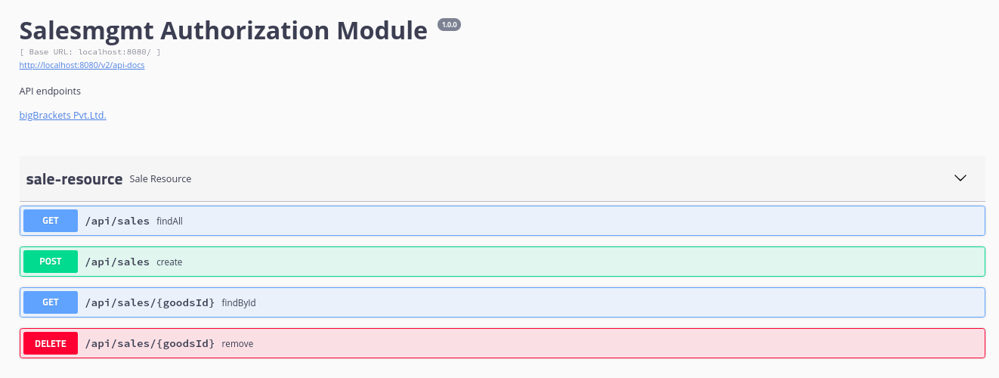
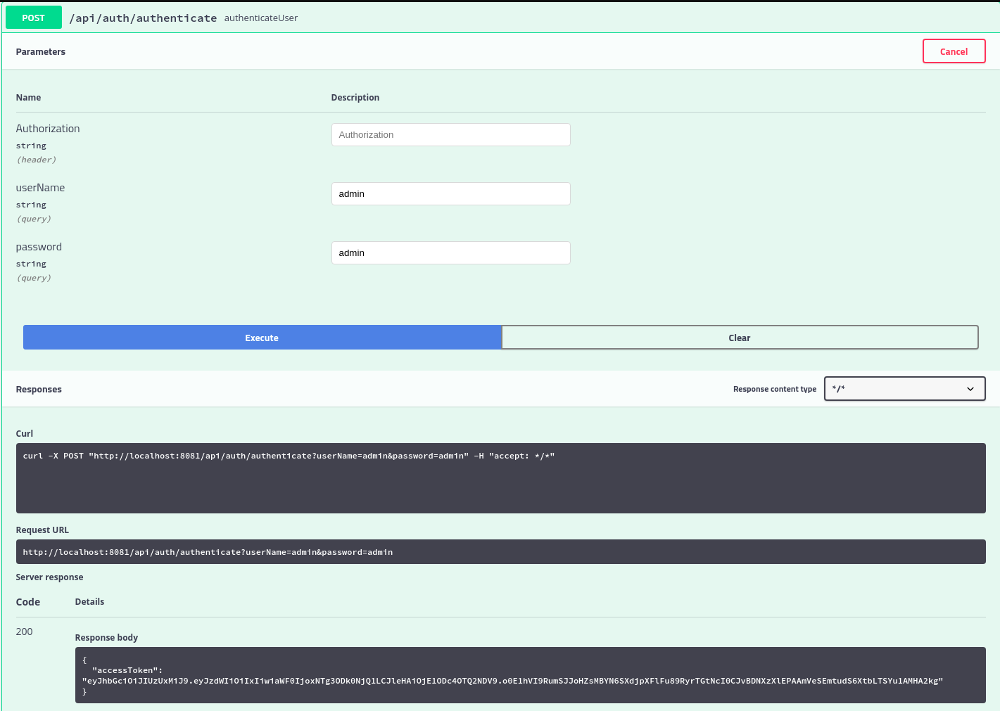
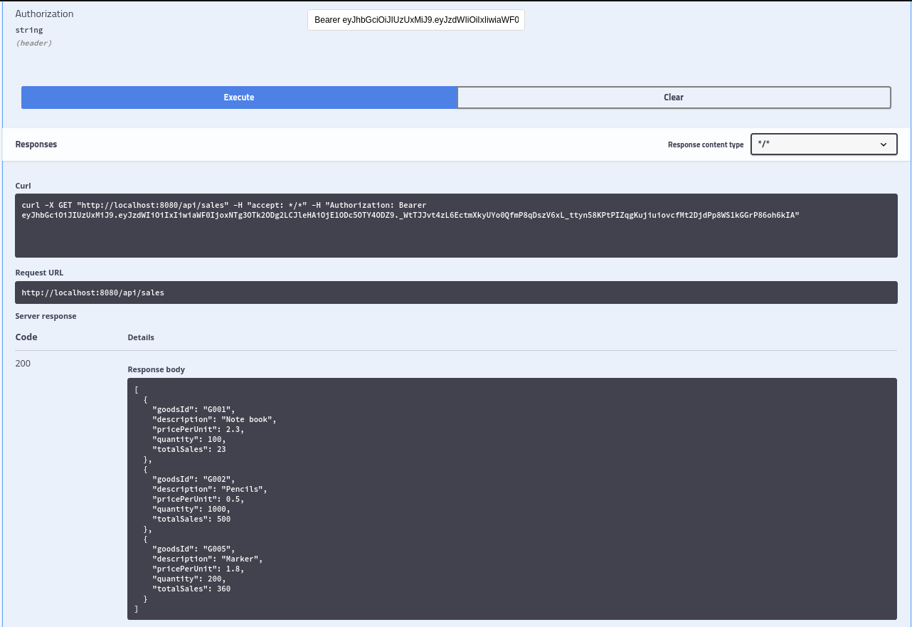
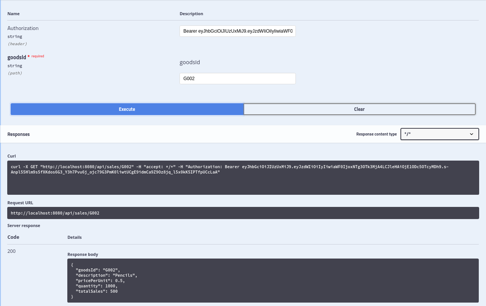
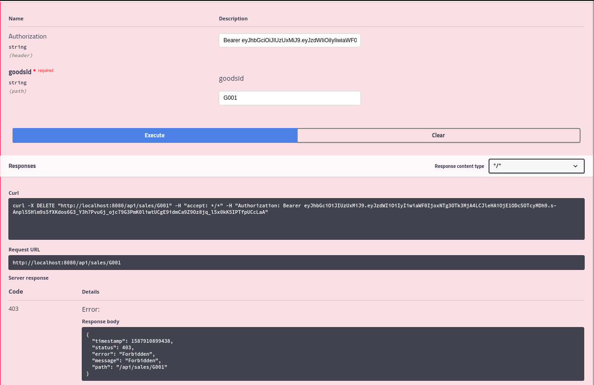

## SalesManagement authorization module
This project demonstrates how we can build an authorization module in spring security and how we can pass authentication to 
another module i.e. [spring-security](https://github.com/nischalshakya15/spring-security) authentication module.  

It is the simple salesmgmt CRUD application using ArrayList. Since, it is the authorization module where user should be 
authenticated before accessing the API. In this case, authentication is done solely in spring-security module and 
only the authorization part is done in this module. 

We have two user (user and admin). User can view sales only whereas Admin can view, update and delete sales. 

## Prerequisite
* Java 8 or higher
* Maven 
* Docker (optional)
* Heroku (optional)
* IDE 

## Build and Run
* git clone https://github.com/nischalshakya15/salesmgmt.git

* Go to the project directory.
    
    ``cd salesmgmt``
    
* Build the project with specific profile. i.e: dev or prod. By default, profile will be dev if not specified.

    ``./mvnw clean -P{PROFILE_NAME} package``
    
* Go to the target directory.
    
    ``cd /target``
    
* Run the project 
    
    ``java -jar salesmgmt-authorization.war``

## Run with docker 
* Build the project using mvn command. 

    ``./mvnw clean -P{PROFILE_NAME} package``
    
* Build and run the container. 

    ``docker-compose --compatibility up``
    
## Deploy in Heroku     
* Add the following dependency in plugins section of pom.xml. 

    ```xml
    <plugin>
      <groupId>com.heroku.sdk</groupId>
      <artifactId>heroku-maven-plugin</artifactId>
      <version>3.0.2</version>
    </plugin>
    ```

* Login into you heroku account.

    ``heroku login``

* Create an app in heroku.

    ``heroku create --app {APP_NAME}``

* Add the following configuration and define processTypes in heroku-maven-plugin section of pom.xml

    ```xml
     <plugin>
          <groupId>com.heroku.sdk</groupId>
          <artifactId>heroku-maven-plugin</artifactId>
          <version>3.0.2</version>
          <configuration>
              <appName>{APP_NAME}</appName>
                  <processTypes>
                      <web>java $JAVA_OPTS -cp target/classes:target/dependency/* org.personal.salesmgmt.SalesmgmtApplication</web>
                  </processTypes>
          </configuration>
     </plugin>
    ```
  or
  
  Create a Proc file in root directory of your project and add the following configuration.

  ``web: java $JAVA_OPTS -cp target/classes:target/dependency/* org.personal.salesmgmt.SalesmgmtApplication`` 

* Deploy the war file in heroku. 

    ``./mvnw clean -P{PROFILE_NAME} heroku:deploy``

* Open the app. 

    ``heroku open``

* View the app logs.

    ``heroku logs --tail``
             

## Swagger documentation
* Go to the browser

   ``http://localhost:8082/swagger-ui.html``

   


## Access an API endpoints 

* Authenticate the user with **userName admin**  and **password admin** or user with **user** and **user** from 
  [spring-security](https://spring-security-jwt-module.herokuapp.com/swagger-ui.html#/auth-resource/authenticateUserUsingPOST) **/api/auth/authenticate** 
  then copy the accessToken.
  
  

* Using that accessToken we can access the protected end points of **sales-resource**.
   
   

* If user token is provided instead of admin token then user can only view the sales 
  but cannot delete or create a sales.

  
  
    

## References 
* https://devcenter.heroku.com/articles/deploying-spring-boot-apps-to-heroku
* https://devcenter.heroku.com/articles/deploying-java-applications-with-the-heroku-maven-plugin
* https://devcenter.heroku.com/articles/setting-the-http-port-for-java-applications
* https://hellokoding.com/spring-resttemplate-error-handling/
* https://www.baeldung.com/jackson-deserialization
* https://vianneyfaivre.com/tech/spring-boot-how-to-handle-resttemplate-exceptions
* https://www.baeldung.com/spring-rest-template-error-handling
    